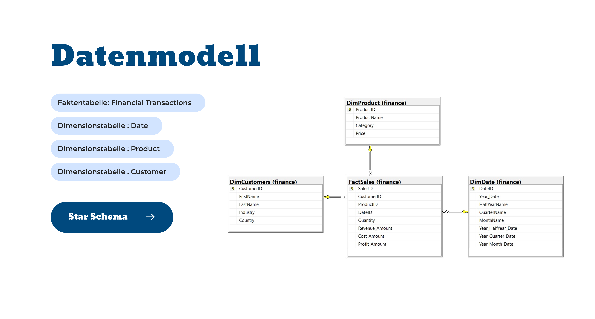
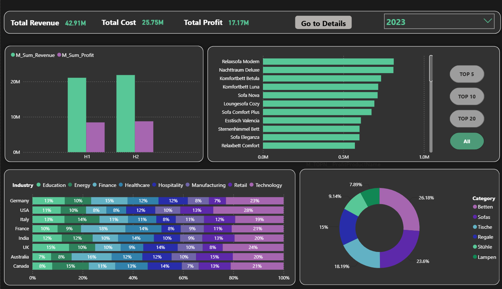
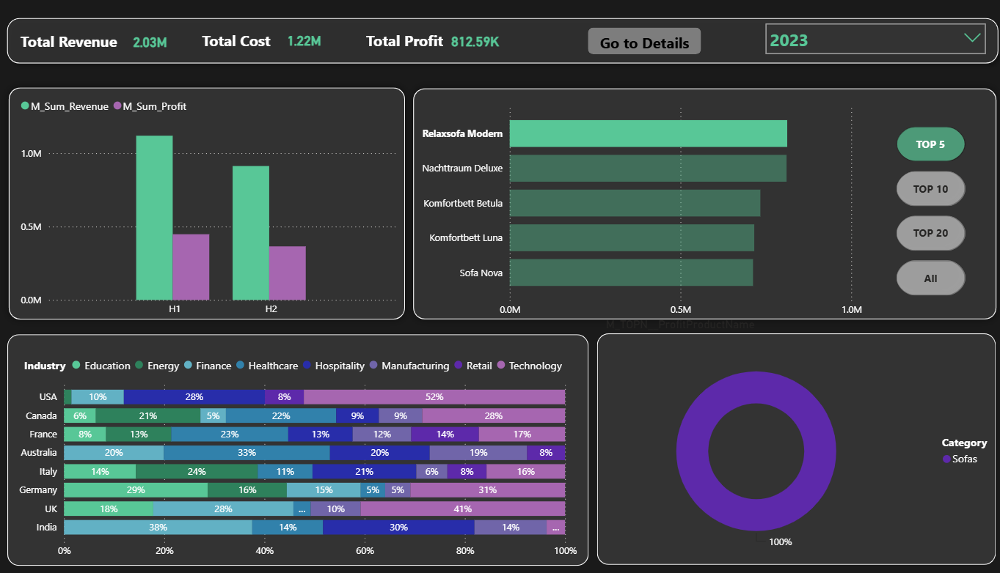
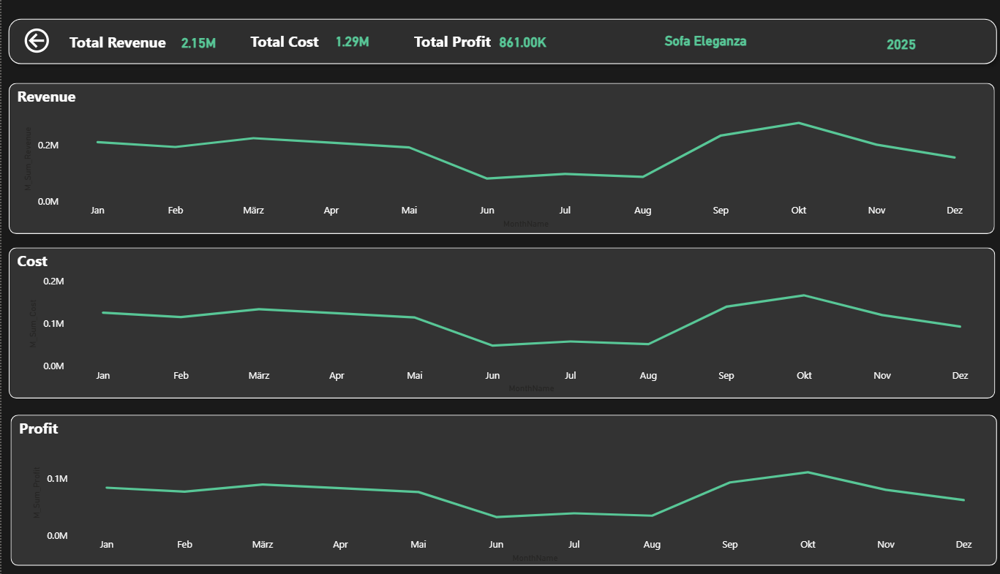
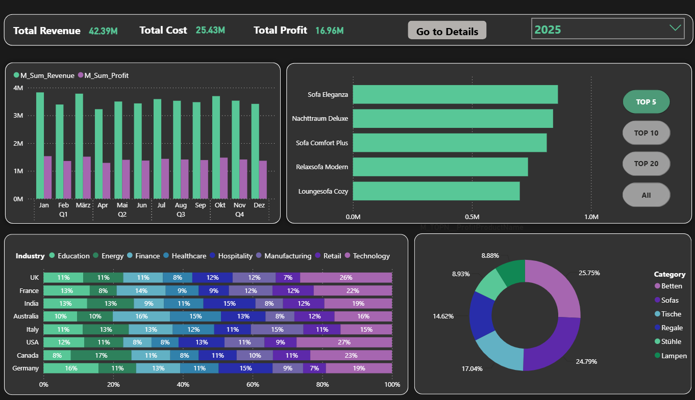
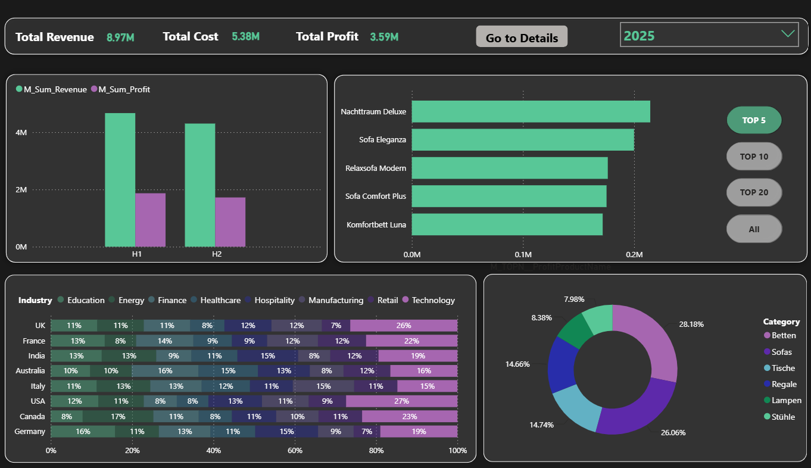

# Sales Analytics Dashboard


## Project Overview

This project demonstrates an end-to-end Business Intelligence solution built using SQL Server and Power BI.

The goal of this project is to transform raw sales data into meaningful business insights through data modeling, SQL analysis, and interactive dashboard design.

## Technologies Used

- SQL Server
- Power BI
- Data Warehouse Modeling
- Star Schema Design
- SQL Analytics
- Business Intelligence


## Business Context

The dataset represents a B2B sales environment in which customers span different industries and countries.

The company sells multiple products across various categories and needs analytical insights to understand sales performance, profitability, customer behavior, and product trends.

## Key Business Questions

The dashboard was designed to answer the following business questions:

- Which country and industry generate the highest revenue and profit?
- What are the monthly and yearly revenue and profit trends?
- How does profit develop throughout the year?
- Which products generate the highest profit?
- How much does profit change from month to month?
- Which products are among the Top N based on yearly profit?


## Data Model

The project follows a Star Schema data warehouse design.



### Fact Table

**Sales**
- SalesID
- CustomerID
- ProductID
- DateID
- Quantity
- Revenue Amount
- Cost Amount
- Profit Amount

### Dimension Tables

**Customer**
- CustomerID
- First Name
- Last Name
- Industry
- Country

**Product**
- ProductID
- Product Name
- Category
- Price

**Date**
- DateID
- Year
- Half Year Name
- Quarter Name
- Month Name
- Year Half Year Date
- Year Quarter Date
- Year Month Date


## SQL Solution

SQL Server was used to prepare and analyze the data.

The project includes analytical SQL queries using:

- Common Table Expressions (CTEs)
- Window Functions
- CASE Statements
- Aggregations
- Views
- Stored Procedures

These solutions were designed to answer business questions and support Power BI reporting.

## Power BI Dashboard

The Power BI dashboard was developed to visualize sales performance and provide actionable business insights.

The dashboard includes:

- KPI tracking
- Sales and profitability analysis (Revenue / Cost / Profit)
- Product performance analysis (Top N analysis)
- Interactive filtering, drill-down, and drill-through functionality
- Time-based analysis
- Customer and industry analysis

## Dashboard Gallery

### Sales Overview




### Product Performance Analysis


#### Top Product Selection




#### Product Drill-Through Analysis




#### Revenue and Profit Drill-Down Analysis




### Industry Analysis




## Business Insights & Recommendations

### 1. Consistent Business Performance

Between 2023 and 2025, the company maintained a relatively stable financial performance with a slight year-over-year decline.

| Year | Revenue | Profit |
|------|---------:|--------:|
| 2023 | 42.91M | 17.17M |
| 2024 | 42.69M | 17.08M |
| 2025 | 42.39M | 16.96M |

Although the business remained profitable, the slight downward trend suggests a mature market with limited growth.

**Recommendation**

Focus on revenue growth through new customer acquisition, additional markets, and higher-value product offerings.

---

### 2. Technology Is the Dominant Customer Industry

Across nearly all countries, customers from the Technology industry represented the largest share.

Examples of Technology industry customer share within each country include:

- USA: 28% (2023), 24% (2024), 27% (2025)
- UK: 24% (2023), 25% (2024), 26% (2025)
- Germany: 23% (2023), 28% (2024)

**Recommendation**

Prioritize sales and marketing activities for technology companies while exploring growth opportunities in underrepresented industries.

---

### 3. Beds and Sofas Are the Strongest Product Categories

The Beds and Sofa categories consistently generated the highest share of total annual profit.

Examples:

| Year | Highest Categories |
|------|--------------------|
| 2023 | Beds (26.18%), Sofa (23.60%) |
| 2024 | Sofa (25.16%), Beds (22.53%) |
| 2025 | Beds (25.75%), Sofa (24.79%) |

**Recommendation**

Increase investment in high-performing product categories and evaluate the business value of lower-performing categories such as Lamps.

---

### 4. Predictable Seasonal Sales Pattern

Revenue and profit followed a consistent seasonal pattern throughout all three years.

Quarter 1 generally delivered the strongest performance, while Quarter 2 showed slightly lower results.

Because the dataset is synthetic, the trends of Revenue, Cost, and Profit are intentionally similar.

**Recommendation**

Use seasonal promotions and targeted campaigns during weaker periods to improve quarterly performance.

---

### Overall Business Recommendation

The business shows strong profitability and operational stability. However, the slight year-over-year decline indicates a potential long-term growth challenge.

The short-term priority should be protecting the strongest segments, especially Technology customers and Beds/Sofa categories.

The medium-term strategy should focus on diversification through new markets, customer segments, and product opportunities to reduce concentration risk.

## How to Explore This Project

To explore this project:

1. Review the SQL scripts in the `sql/` folder to understand the data preparation and analysis logic.
2. Open the Power BI file from the `powerbi/` folder to interact with the dashboard.
3. Review dashboard screenshots and visual documentation in the `images/` folder.

## Repository Structure

```text
sales-analytics-dashboard
│
├── README.md
├── images/
├── sql/
├── powerbi/
└── docs/
```

## Data Privacy

The dataset used in this project was generated from scratch using AI-assisted data generation.

The data is synthetic and created for educational and portfolio purposes. It does not contain any real customer information or personally identifiable data (PII).
